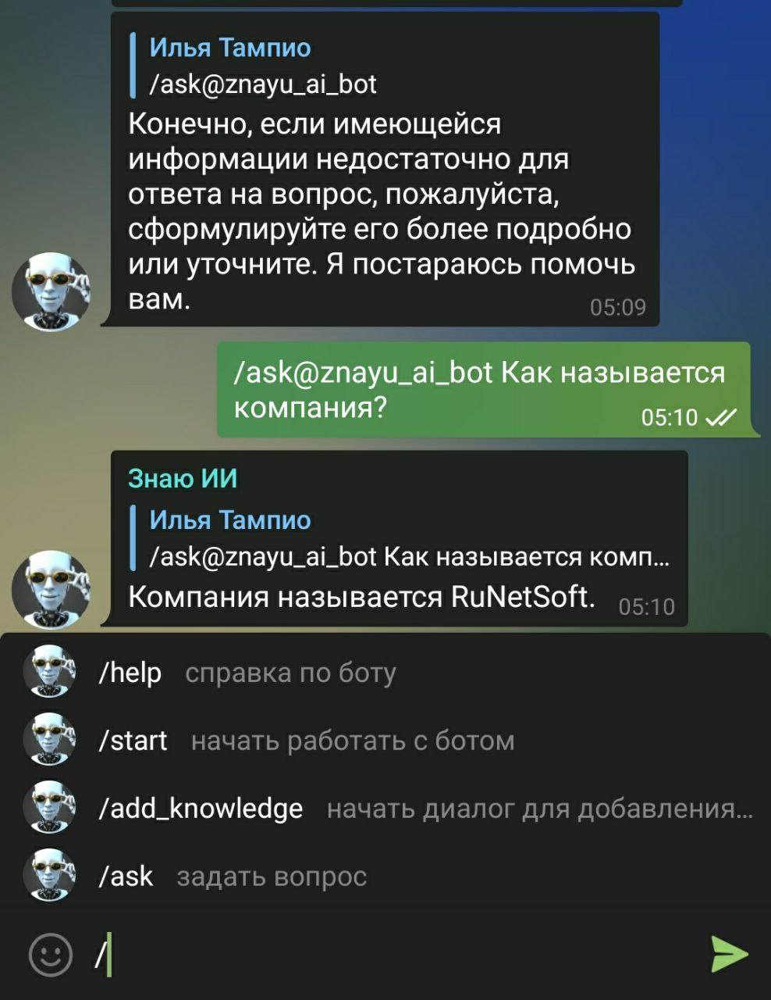
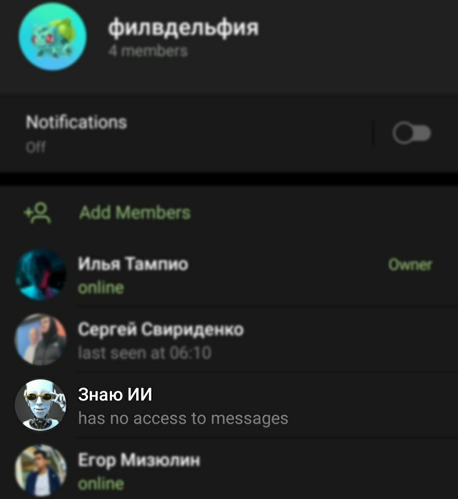

# "Знаю" - Микросервис и чатбот в телеграм для генерации ответов на вопросы

Этот проект использует [OpenAI](https://openai.com/) для генерации ответов на вопросы к базе знаний. Бот доступен по ссылке: [t.me/znayu_ai_bot](https://t.me/znayu_ai_bot)

## Навигация

- [**ML сервис - "Знаю" - ИИ Помощник для базы знаний**](https://github.com/philadelphia-rus/znayu-ai) <-- Вы здесь
- [Бекенд](https://github.com/philadelphia-rus/Backend)
- [Мобильное приложение](https://github.com/philadelphia-rus/mobile-app)

## Стек

Основной язык: *Python 3.8+*

- openai  - API для генерации текста
- scikit  - TF-IDF векторизация текста и подсчет косинусной близости
- fastapi - API для сервиса
- aiogram - API для бота в телеграм

## Описание механизма генерации ответа

### Подготовка базы знаний

1. В базе знаний хранятся пары вопрос-ответ. Вопросы и ответы представлены в виде текста.
2. Для удобства и в целях демонстрации имеется метод add_knowledge, позволяющий в рантайме добавить новую пару. Эта пара пропадает после перезапуска сервиса.

### Генерация ответа на вопрос

1. Пользователь задает вопрос
2. Сервис ищет в базе знаний похожие вопросы (TOP_N вопросов). Поиск осуществляется по TF-IDF векторам вопросов.
3. Сервис генерирует ответ на вопрос с помощью OpenAI API. В качестве входных данных используется вопрос и ответы на похожие вопросы.
4. Сервис возвращает ответ пользователю.

## Запуск проекта

```bash
echo "OPENAI_API_KEY='OPENAI_TOKEN_HERE'"  >> .env
echo "TELEGRAM_BOT_TOKEN='TELEGRAM_TOKEN_HERE'" > .env
make install

# Запуск сервиса
make start_bot               # Запуск бота в телеграм
make start_service           # Запуск сервиса
make start_docker_fastapi    # Запуск сервиса в докере
```

## Фичи

- Динамическое измнение базы данных
- Возможность использования в качестве телеграм бота
- Наглядный интерфейс API

## Скриншоты




## Авторы

Команда Филадельфия по-русски в рамках хакатона EESTECH Challenge 2023 от EESTEC LC Saint-Petersburg - [hack link](https://codenrock.com/contests/hackathon-eestech-challenge#/)

**Команда:**

| **Команда** | **Роль** |
| --- | --- |
| [Тампио Илья](t.me/Quakumei) | Python: ML, Backend |
| [Свириденко Сергей](t.me/neroun4002) | Java: Backend |
| [Мизюлин Егор](t.me/tw0ch) | Dart/Flutter: Mobile |
